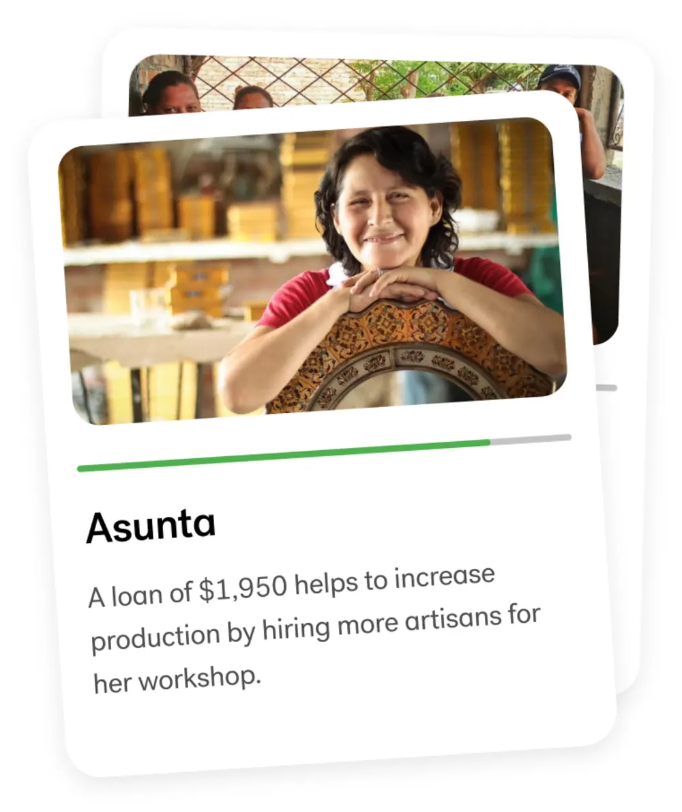
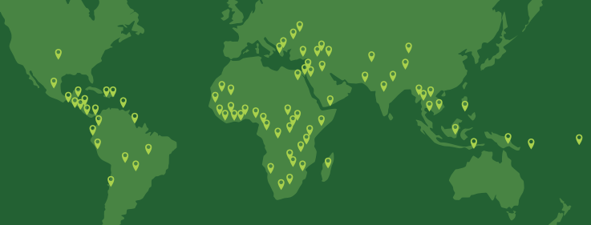
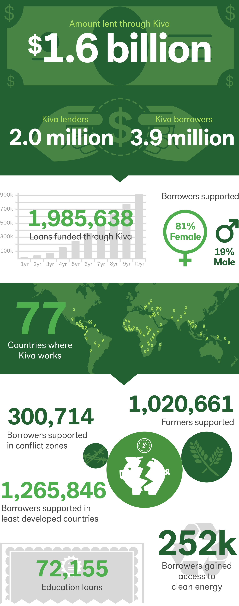

# **KIVA.org**

(Adnan Quaderi)

## Overview and Origin

Name of company 

* Kiva

When was the company incorporated?

* 2005

Who are the founders of the company?

* Kiva was founded by Matt Flannery and Jessica Jackley.

How did the idea for the company (or project) come about?

* Founder's interest microfinance was inspired by a 2003 lecture given by Grameen Bank's Muhammad Yunus (Nobel Laureate) at Stanford Business School.

How is the company funded? How much funding have they received?

* Kiva is a pioneer in crowdfunding.  Most of the operating costs are funded through donations made by Kiva lenders. The remainder is covered through grants and donations from foundations.

## Business Activities:

What specific financial problem is the company or project trying to solve?

* Kiva's mission is to expand financial access to help underserved communities thrive.

Who is the company's intended customer?  Is there any information about the market size of this set of customers?

* 81% of Kiva's customer's are women in rural areas of developing countries.

What solution does this company offer that their competitors do not or cannot offer? (What is the unfair advantage they utilize?)

* Though there are numerous peer to peer lending platform.  Kiva is unique as they are lending to the world's impoverished and are a non-profit.

Which technologies are they currently using, and how are they implementing them? 

* Kiva uses the internet to connect lenders and impoverished borrowers in developing nations.  Kiva uses PayPal exclusively for payment processing.

## Landscape:

What domain of the financial industry is the company in?

* Microfinance

What have been the major trends and innovations of this domain over the last 5-10 years?

* Crowdfunding, deployment of internet, electronic payment technology, machine learing.

What are the other major companies in this domain?

* United Prosperity, Vittana, Wokai

---

## Results

What has been the business impact of this company so far?

* Kiva has lent $1.6bio to 3.9mio borrowers of whom 81% are women.  1.26mio of the borrowers are in the least developed countries

What are some of the core metrics that companies in this domain use to measure success? How is your company performing, based on these metrics?

* Core metrics used to measure performance of microcredit progamrs are: value and number of loans, types of financial services offered, number of branches established, percentage of target population served, annual growth rate of assets, participation of women etc.

How is your company performing relative to competitors in the same domain?

* Kiva is a leader.

  
---

## Recommendations

If you were to advise the company, what products or services would you suggest they offer? 

* Kiva should also lend to entrepreneurs in the developing world and provide connectivity for peer to peer lending in the developing world with a cap on interest rates charged to prevent abuse.

Why do you think that offering this product or service would benefit the company?

* As a non profit, the benefit would be the pool of lenders can expand.  Kiva should diversify into additional mobile electronic payments systems.

Why are these technologies appropriate for your solution?

* Kiva may use Machine Learning and AI technology to optimize performance by incorporating a utility or economic value measurement.

